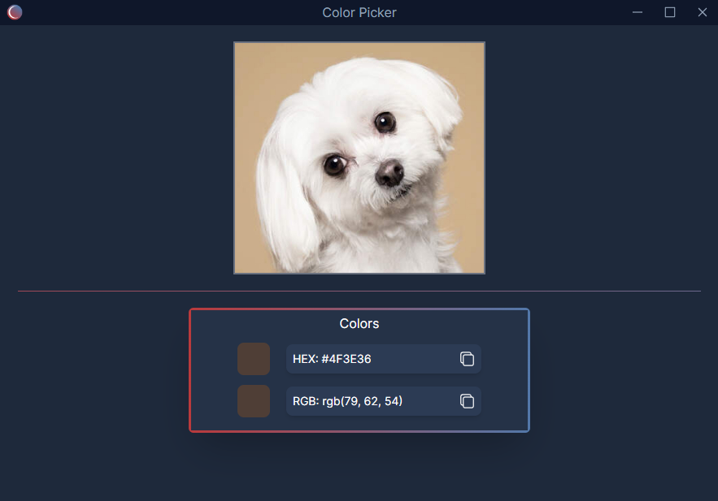

# Color Picker

A desktop color-picking application created using Electron and React, which\
allows users to screenshot a section of their screen and use the built-in\
eye-dropper tool!

 

## Usage

After the application has started, it should show up in the tray icons.

 

The application registers a global shortcut: **CTRL + SHIFT + X**,\
which is used to start the screenshot and cropping tool.

### Screenshotting and Cropping

The screenshot and cropping tool can be accessed by three ways:

 

1. Using the global shortcut: **CTRL + SHIFT + X**
2. Left-clicking the tray icon
3. Right-clicking the tray icon and clicking **Capture Image**

Begin screenshotting by holding left-click at the desired start point of the image\
on the screen, dragging the mouse to the end point of the image and releasing left-click.

The selected screenshot will then be sent to the main color picking window,\
and will also be **copied into clipboard** for pasting and sharing in other\
applications.

### Picking Colors
The color picking tool can be accessed by:

Right-clicking the tray icon and clicking **Show** in the context menu.

The screenshotted image will be displayed in the main color picking window,\
where hovering the cursor over the image will begin the eye-dropping tool.

The **Colors** section below the image will show both the currently hovered color\
the cursor is on, along with the current selected color.

A color can be selected by left-clicking the pixel on the image where the desired color is.

 

Both the **HEX** value and **RGB** value will be displayed upon selecting a color,\
and can be copied into the clipboard by clicking the icon to the right of either.

## Dev Installation

1. Run `npm install` to install project dependencies
2. Run `npm start` to start up the application

## Distribution

### `npm run build`

Builds the app for production and distribution to the `dist` folder.\
Once successfully built, a setup file should appear in the `dist` folder.\
This can be used to distribute and install your application on other systems.
